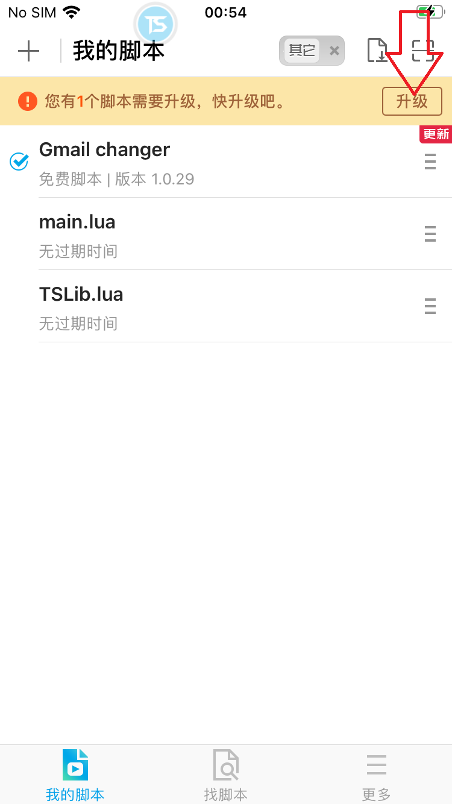

<b>Chuẩn bị</b>

- Điện thoại 6s ios 14
- 1 vps window hoặc máy tính nhà đã mở port modem (win8 hoặc win10 hoặc winserver2012)
- Giá tool: 500k / tháng / 1 thiết bị. Liên hệ hỗ trợ: https://t.me/thoconlonton

<b>Hướng dẫn sử dụng</b>

<!-- 

  
Click to expand!

  ## Heading
  1. A numbered
  2. list
     * With some
     * Sub bullets

 -->

  
CÀI ĐẶT WEB MAIL

1. Ở vps download và cài đặt python 3.9.9. Nhớ tích như hình bên dưới
   Link download: https://www.python.org/ftp/python/3.9.9/python-3.9.9-amd64.exe
   
2. Ở vps download và cài đặt web mail ở đây: https://github.com/emga9xkc2/web-mail-release/archive/refs/heads/main.zip
3. Download xong giải nén và chạy file setup.bat trong thư mục setup
4. Quay lại tìm và chạy file Main (Main.lnk) lên là ok
5. Sau khi mở lên nếu thấy thông báo Thay port trong file data/hconfig.ini thì mở file hconfig.ini lên, sửa dòng port = -1 thành port = xxx, rồi lưu lại. Ví dụ port = 789
6. Mở chrome vào http://ipv4.icanhazip.com/ để lấy ip vps. Ví dụ ip vps lấy được là 42.211.1.8
7. Mở tab mới truy cập 42.211.1.8:789 đăng nhập tài khoản mật khẩu là admin admin. Sau đó vào quản lý tài khoản copy apikey và đổi mật khẩu thành mật khẩu mong muốn.
8. Copy 42.211.1.8:789 và apikey ra đâu đó để lát nữa xài
9. LƯU Ý: NẾU BƯỚC 7 KHÔNG TRUY CẬP ĐƯỢC. Hãy tắt tường lửa ở vps rồi thử lại. Nếu vẫn không được hãy mở port cho vps. Google để tìm cách mở, hoặc liên hệ người bán để bảo họ mở cho

  
HƯỚNG DẪN JB IPHONE

1. Tham khảo video: https://www.youtube.com/watch?v=MQlxhBe9hP0

  
CÀI ĐẶT TOUCHSPRITE

1. Mở cydia, chọn Sources, chọn Edit, chọn Add, xóa hết url đi nhập dòng này vào rồi bấm Add Source: http://apt.touchsprite.com
2. Hoặc làm theo video: https://www.youtube.com/watch?v=XdP5gIpjCjw

  
CẤU HÌNH TOUCHSPRITE

Bật icon chạy nhanh và tải thư viện cần thiết. làm theo video: https://www.youtube.com/watch?v=TKJLksfG7L8
Như trong video có file chi_sim.traineddata. Tải hết sạch hoặc bỏ lại file này k tải cũng được

  
CÀI ĐẶT TOOL

1. Download file: https://github.com/emga9xkc2/gmail-changer-ios-release/raw/main/gmail_changer.tsp
2. Sau đó dùng 3utool copy file vừa tải về vào thư mục: /private/var/mobile/Media/TouchSprite/lua trên iphone rồi chạy file trên

  
CÀI ĐẶT Ở TOOL

1. TÊN THIẾT BỊ. thích nhập gì thì nhập
2. IPSERVER:PORT. nhập

- Xem lại ở mục 5,6,7,8 CÀI ĐẶT WEB MAIL
- Mẫu: 42.211.1.8:789

3. API KEY SERVER. Vào quản lý tài khoản để lấy. Xem lại ở mục 7 CÀI ĐẶT WEB MAIL
4. API KEY PROXY. nếu dùng tinsoft thì mua api rồi nhập vào đây, không thì dùng bỏ qua ô này
5. Các phần còn lại tùy chọn

  
CẬP NHẬT PHIÊN BẢN MỚI

Ở trong giao diện script touchsprite, vuốt từ trên xuống. Nếu thấy dòng chữ đỏ như ảnh dưới. Bấm vào mũi tên như ảnh bên dưới để cập nhật bản mới nhất

<b>Thông tin phiên bản</b>

Hỗ trợ change ip bằng 3g, tinsoft, vypr 
Chức năng: đổi mật khẩu, đổi email khôi phục, tạo kênh youtube, đăng xuất thiết bị 
